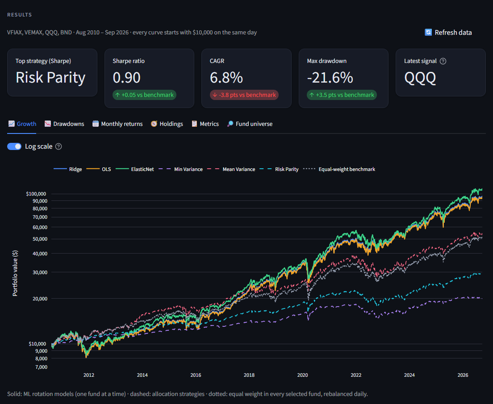
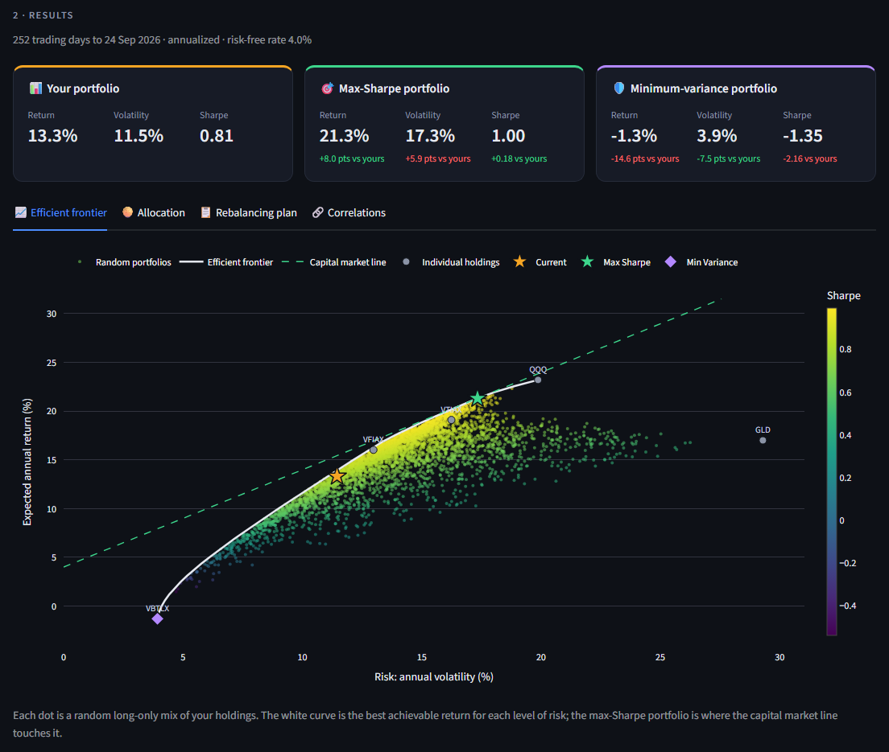
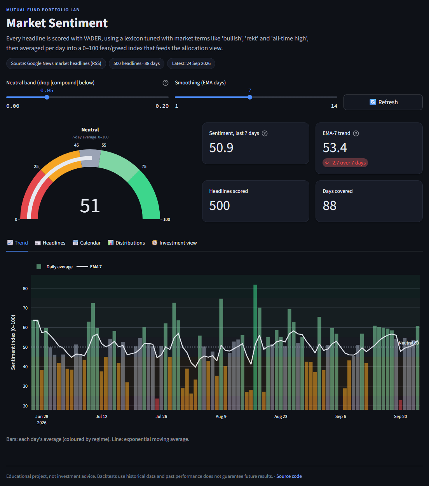

# Mutual Fund Portfolio Lab

A multi-page [Streamlit](https://streamlit.io) app for mutual-fund and ETF
research on live market data: machine-learning momentum backtests,
Sharpe-optimal portfolio construction, and a news-sentiment regime signal.

**▶ [Open the live app](https://crypto-tracker-and-portfolio-management-aiamouaxdduqc7grbhclme.streamlit.app/)**
(if it has been idle, Streamlit Cloud takes about a minute to wake it up)



## What's inside

| Page | What it does |
|------|--------------|
| **Momentum Explorer** (home) | Can a model pick which fund to hold tomorrow? Ridge, OLS and ElasticNet models are retrained walk-forward on momentum, RSI, volatility and volume features, and each day the strategy holds the fund with the best next-day forecast. Results are compared with Min-Variance, Mean-Variance and Risk-Parity allocations and an equal-weight benchmark: growth, drawdowns, a monthly-returns calendar, what each model held, and Sharpe / CAGR / volatility / max-drawdown / turnover. |
| **Portfolio Optimizer** | Enter your holdings (a sample mutual-fund portfolio is preloaded) to get the max-Sharpe and minimum-variance mixes (SciPy SLSQP, long-only), the efficient frontier with the capital market line, a correlation matrix, and a rebalancing plan in dollars. |
| **Market Sentiment** | Scores market news headlines with a VADER lexicon tuned for market slang, builds a 0–100 fear/greed index with a smoothed trend, and maps the regime to a Defensive / Core / Risk-On allocation that uses the best momentum model as its Risk-On sleeve. |



## Methodology notes

The backtest is built to avoid the usual ways a backtest flatters itself:

- **No look-ahead.** Features on day *t* use prices up to *t* only; models learn
  to predict the *next* day's return, and the return booked for a decision is
  day *t+1*'s.
- **Walk-forward training.** Models are refit every *n* days on everything known
  at that point, with features standardised using only the training window's
  statistics.
- **Trading days only.** Rows are never expanded to calendar days, so weekend
  and holiday returns are never invented.
- **One comparison window.** Every strategy and the benchmark are cut to the same
  dates and rebased to the same starting capital, so CAGRs are comparable.
- **Costs and turnover are visible.** An optional per-switch trading cost, plus
  switches per year and time in cash, for every model.

Mutual funds report no trading volume on Yahoo Finance, so their volume
feature is held neutral instead of being dropped.



## Tech stack

Python · Streamlit · pandas / NumPy · scikit-learn · SciPy · Plotly · yfinance · NLTK (VADER)

## Run locally

```bash
pip install -r requirements.txt      # Python 3.11 or 3.12 recommended
streamlit run Momentum_Explorer.py   # http://localhost:8501
```

All market data is fetched live (Yahoo Finance for prices, Google News for
headlines) and cached in memory, so there are no datasets to download and no
API keys required.

### Optional configuration

Create `.streamlit/secrets.toml` (git-ignored, never commit it):

```toml
COINDESK_API_KEY = "your-coindesk-key"   # optional: score CoinDesk articles instead of Google News headlines
```

Secrets are read via `st.secrets` with an environment-variable fallback.

## Deploy to Streamlit Community Cloud

1. Push this repo to GitHub, including `.streamlit/config.toml` (the dark theme
   the UI is designed for) but **not** `.streamlit/secrets.toml`.
2. On [share.streamlit.io](https://share.streamlit.io): **Create app →** this
   repository, branch `main`, main file `Momentum_Explorer.py`.
3. Optionally paste the TOML above under **Advanced settings → Secrets**.

If Yahoo Finance rate-limits the shared cloud IP, wait a minute and use
**Refresh data**. Prices are cached for an hour and backtest results for a day.

## Project structure

```
Momentum_Explorer.py        home page: momentum backtests
pages/
  Portfolio_Optimizer.py    Sharpe optimisation + efficient frontier
  Sentiment_Analysis.py     news sentiment + allocation view
  cores/
    reader.py               feature engineering and cleaning
    ml.py                   walk-forward model training
    runners.py              rotation backtest engine
    portfolio_optimizer.py  mean-variance optimisation
    sentiment_pipeline.py   news download + VADER scoring
    ui.py                   shared theme and page chrome
    yf_session.py           browser-impersonating Yahoo session
.streamlit/config.toml      theme
docs/                       README screenshots
```

---

Built by [Pranav](https://www.linkedin.com/in/pranav2ranjit). Educational
project, not investment advice. Past performance does not guarantee future
results.
